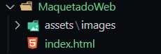

# Index
Comenzaremos la maquetación por el Index
Ahora mismo será una web estática, puro html y css.
```html
<!DOCTYPE html>
<html lang="en">
<head>
    <meta charset="UTF-8">
    <title>Maquetación Web</title>
</head>
<body>
    <h1>Bienvenido a Maquetación Web</h1>
</body>
</html>
```

Este es el primer paso para empezar a desarrollar la maquetación.
Procedemos a hacer la Cabecera y la Barra de Navegación. 
Vamos a tener un *header* que ocupe todo el ancho de la pantalla. Pero luego dentro de ese ancho vamos a tener contenido centrado.
```html
<!DOCTYPE html>
<html lang="en">
<head>
    <meta charset="UTF-8">
    <title>Maquetación Web</title>
</head>
<body>
    <header id="header">
        <!-- Contenido aquí -->
    </header>
</body>
</html>
```

Vamos a ir poniendo comentarios, de lo que vamos a tener en nuestra estructura.

```html
<!DOCTYPE html>
<html lang="en">
<head>
    <meta charset="UTF-8">
    <title>Maquetación Web</title>
</head>
<body>
    <header id="header">
        <div class="center" >
            <!-- LOGO -->
            <div id="logo" >
                
            </div>
            <!-- MENÚ -->
        </div>
    </header>
</body>
</html>
```

Ahora que tenemos esto, vamos a crear una carpeta que se llamará `/assets` y dentro de esa carpeta tendremos otra que se llamará `/images`, que es donde vamos a insertar las imágenes con las que vamos a trabajar, logotipos también.



Procederemos a guardar un logotipo, en este caso, yo tengo uno personal, que voy a colocar, ustedes puede buscar ejemplos en repositorios de imágenes siempre y cuando sea de uso público.
Lo ideal es usar imágenes `.svg` para logos y eso, por el tema de la calidad.

```html
<!DOCTYPE html>
<html lang="en">
<head>
    <meta charset="UTF-8">
    <title>Maquetación Web</title>
</head>
<body>
    <header id="header">
        <div class="center" >
            <!-- LOGO -->
            <div id="logo" >
                
            </div>
            <!-- MENÚ -->
        </div>
    </header>
</body>
</html>
```

Ahora que ya hemos cargado el logo, podremos verificar en nuestro navegador que ya se encuentra nuestro logo, sin embargo aún no tiene estilos, cosa que haremos con css.

```html
<!DOCTYPE html>
<html lang="en">
<head>
    <meta charset="UTF-8">
    <title>Maquetación Web</title>
</head>
<body>
    <header id="header">
        <div class="center" >
            <!-- LOGO -->
            <div id="logo" >
                
                <span id="brand">
                    <strong>Staenly</strong>Rivas
                </span>
            </div>
            <!-- MENÚ -->
        </div>
    </header>
</body>
</html>
```

Bien, ahora nos quedaría maquetar el menú. Para ello utilizaremos la etiqueta *nav*, la semántica dice que representa la parte de los enlaces en un sitio web.

```html
<!DOCTYPE html>
<html lang="en">
<head>
    <meta charset="UTF-8">
    <title>Maquetación Web</title>
</head>
<body>
    <header id="header">
        <div class="center" >
            <!-- LOGO -->
            <div id="logo" >
                
                <span id="brand">
                    <strong>Staenly</strong>Rivas
                </span>
            </div>

            <!-- MENÚ -->
            <nav id="menu" >
                <ul>
                    <li>
                        <a href="#">Inicio</a>
                    </li>
                    <li>
                        <a href="#">Blog</a>
                    </li>
                    <li>
                        <a href="#">Formulario</a>
                    </li>
                    <li>
                        <a href="#">Página 1</a>
                    </li>
                </ul>
            </nav>
        </div>
    </header>
</body>
</html>
```
Ya para la maquetación, por el momento esto nos sirve, lo que haríamos durante esta sección de maquetación web.

Ahora, lo que haremos es vincular una hoja de estilos para poder estilar nuestro header y la barra de navegación.

Para ello, vamos a crear una carpeta nueva dentro de `/assets`, la carpeta `/css` y dentro crearemos el archivo `styles.css` 

```css
body {
    text-align: center;
    background: #3C5B6F;
}
```

Luego, debemos cargar estos estilos en nuestro `index.html` 
```html
...
<head>
    <meta charset="UTF-8">
    <title>Maquetación Web</title>
    <!-- Hoja de Estilos -->
    <link rel="stylesheet" href="assets/css/styles.css">
</head>
...
```
Ahora, si cargamos, vemos que los cambios se han guardado.
Bueno, ya podemos quitarle el fondo, porque sólo fue para efectos de funcionalidad del css.

```css
body {
  text-align: center;
}

#header {
  height: 120px;
  width: 100%;
  background: white;
  border-bottom: 1px solid #ccc;
  border-top: 4px solid #3c5b6f;
}
```

Si vemos en el navegador, nos daremos cuenta que hay una línea súper delgada, y hay espacios laterales, esto es porque el navegador siempre formatea por default, de forma que si queremos quitarlo, pues modificamos.

```css
body {
  text-align: center;
  margin: 0px;
  padding: 0px;
}
```
Ya con esto nos damos cuenta que se ha modificado.
Ya tenemos el header hecho, dentro del header irá el contenido que deseamos maquetar.
Luego, vamos con el logo.

```css
/* Maquetando logo, y marca */
#logo {
  width: 35%;
  font-size: 30px;
  float: left;
}

#logo img {
  display: block;
  float: left;
  height: 75px;
}

#brand {
  display: block;
  margin: 0px;
  float: left;
}
```

Claramente, debemos centrar todo el contenido porque ahora vemos que está todo desalineado y desordenado.

```css
.center {
  width: 75%;
  margin: 0px auto;
  /*centra un elemento*/
}
```
De esta manera ya vemos que el contenido se ha centrado, sin embargo, hay mucho que hace falta por hacer. Pero vemos que ya tiene mejor forma la cabecera.
