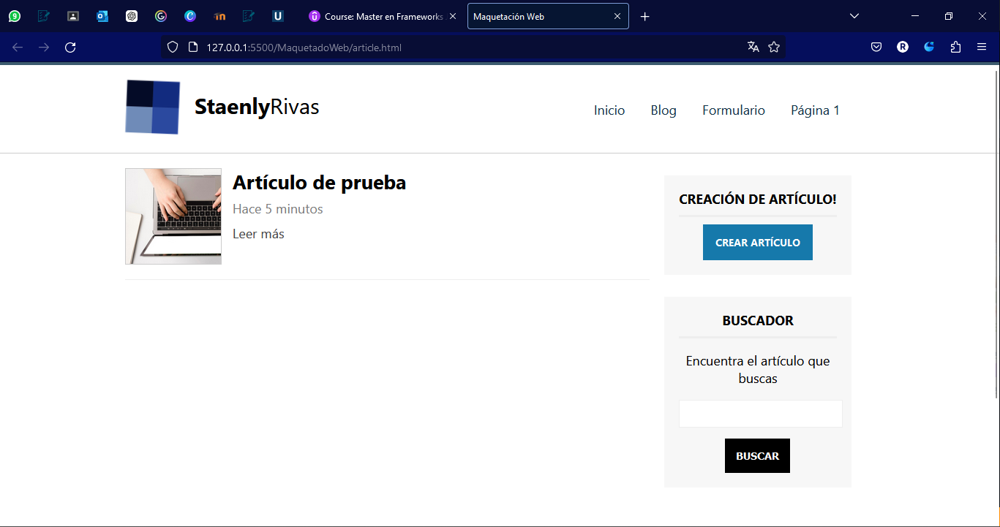

# Detalles de artículos, formulario con HTML5 y estilos con CSS, y enlaces con HTML

## Página de detalle de los artículos

Vamos a crear la página de detalle de los artículos, basicamente copiamos todo el contenido de `index.html` y cambiamos algunas cosas...
Creamos el archivo llamado `article.html` y pegamos el contenido.
Quitaremos:

- el script de los artículos
- subheader y div de articles
- el slider

dejándolo así:


```html
<!DOCTYPE html>
<html lang="en">
  <head>
    <meta charset="UTF-8" />
    <title>Maquetación Web</title>
    <!-- Hoja de Estilos -->
    <link rel="stylesheet" href="assets/css/styles.css" />
  </head>
  <body>
    <header id="header">
      <div class="center">
        <!-- LOGO -->
        <div id="logo">
          
          <span id="brand"> <strong>Staenly</strong>Rivas </span>
        </div>

        <!-- MENÚ -->
        <nav id="menu">
          <ul>
            <li>
              <a href="./index.html">Inicio</a>
            </li>
            <li>
              <a href="./blog.html">Blog</a>
            </li>
            <li>
              <a href="#">Formulario</a>
            </li>
            <li>
              <a href="#">Página 1</a>
            </li>
          </ul>
        </nav>

        <!-- LIMPIAR FLOTADOS -->
        <div class="clearfix"></div>
      </div>
    </header>

    <!-- Sidebar -->
    <div class="center">
      <section id="content">
        <article class="article-item" id="article-template">
          <div class="image-wrap">
            
          </div>
          <h2>Artículo de prueba</h2>
          <span class="date"> Hace 5 minutos </span>
          <a href="#">Leer más</a>
          <div class="clearfix"></div>
        </article>
      </section>

      <aside id="sidebar">
        <div id="nav-blog" class="sidebar-item">
          <h3>Creación de artículo!</h3>
          <a href="#" class="btn btn-success">Crear artículo</a>
        </div>

        <div id="search" class="sidebar-item">
          <h3>Buscador</h3>
          <p>Encuentra el artículo que buscas</p>
          <form>
            <input type="text" name="search" />
            <input class="btn" type="submit" name="submit" value="Buscar" />
          </form>
        </div>
      </aside>

      <!-- LIMPIAR FLOTADOS -->
      <div class="clearfix"></div>
    </div>

    <footer id="footer">
      <div class="center">&copy; Developed by Nestor Rivas</div>
    </footer>
  </body>
</html>
```

Y vamos a dejarlo como si tuvieramos un artículo en concreto
Regresamos al `article.html` y en lugar de tener un `h2` lo dejamos con `h1`
Quitaremos lo de leer más
y vamos a colocar un párrafo que será donde lleve todo el contenido, en mi caso, haré un párrafo con _lorem ipsum_ pero en su caso deberán escribir algo relacionado con el artículo del que hablen en esta sección.
Esto podría ir en un sólo párrafo o en párrafos separados.

```html
<!DOCTYPE html>
<html lang="en">
  <head>
    <meta charset="UTF-8" />
    <title>Maquetación Web</title>
    <!-- Hoja de Estilos -->
    <link rel="stylesheet" href="assets/css/styles.css" />
  </head>
  <body>
    <header id="header">
      <div class="center">
        <!-- LOGO -->
        <div id="logo">
          
          <span id="brand"> <strong>Staenly</strong>Rivas </span>
        </div>

        <!-- MENÚ -->
        <nav id="menu">
          <ul>
            <li>
              <a href="./index.html">Inicio</a>
            </li>
            <li>
              <a href="./blog.html">Blog</a>
            </li>
            <li>
              <a href="#">Formulario</a>
            </li>
            <li>
              <a href="#">Página 1</a>
            </li>
          </ul>
        </nav>

        <!-- LIMPIAR FLOTADOS -->
        <div class="clearfix"></div>
      </div>
    </header>

    <!-- Sidebar -->
    <div class="center">
      <section id="content">
        <!-- agregar clase article-detalle y quitamos el id -->
        <article class="article-item article-detalle">
          <div class="image-wrap">
            
          </div>
          <h1 class="subheader">Artículo de prueba</h1>
          <span class="date"> Hace 5 minutos </span>
          <p>
            Lorem ipsum dolor sit amet consectetur, adipisicing elit. Voluptatem
            ipsa obcaecati veritatis molestiae explicabo id laborum nisi ipsam
            totam? Optio distinctio vitae neque cupiditate blanditiis commodi
            autem quidem, incidunt exercitationem?
            <br /><br />
            Voluptate mollitia, repudiandae tempore illo cum vel tempora natus
            vero perferendis ipsum ut veniam accusamus, quasi non quaerat
            doloremque laborum? Eos deserunt at distinctio ipsum dolore
            doloribus alias explicabo deleniti? Non laudantium quisquam at totam
            quidem asperiores id rem molestias dicta temporibus, veritatis vero
            perferendis, voluptatum deleniti cum consequatur in vitae quos quae
            esse? Labore, voluptatum odio? Consequatur, repellat quos.
            Asperiores, accusamus nostrum sequi ipsum distinctio natus quos amet
            beatae perspiciatis, fuga nemo ducimus esse ipsam qui unde, mollitia
            necessitatibus dolorem eum id eligendi excepturi dolores omnis.
            Provident, iure alias. Provident unde molestiae ullam nostrum ipsa
            modi ipsum neque earum necessitatibus minus ea expedita rerum non,
            veritatis tempora maiores cumque. Dignissimos numquam aliquam
            ratione nobis necessitatibus aut, dolores inventore veniam.
            <br /><br />
            Quis laborum accusantium beatae repellat perspiciatis mollitia ea
            ducimus sunt ab rerum. Omnis sit corrupti nostrum quas eaque optio,
            veniam non? Maxime quidem nam, vitae atque aut ipsum velit omnis!
          </p>
          <div class="clearfix"></div>
        </article>
      </section>

      <aside id="sidebar">
        <div id="nav-blog" class="sidebar-item">
          <h3>Creación de artículo!</h3>
          <a href="#" class="btn btn-success">Crear artículo</a>
        </div>

        <div id="search" class="sidebar-item">
          <h3>Buscador</h3>
          <p>Encuentra el artículo que buscas</p>
          <form>
            <input type="text" name="search" />
            <input class="btn" type="submit" name="submit" value="Buscar" />
          </form>
        </div>
      </aside>

      <!-- LIMPIAR FLOTADOS -->
      <div class="clearfix"></div>
    </div>

    <footer id="footer">
      <div class="center">&copy; Developed by Nestor Rivas</div>
    </footer>
  </body>
</html>
```

Ya tenemos el HTML, ahora vamos con los estilos...

```css
/* Estilos a detalles de artículo */
.article-detalle .image-wrap {
  float: none;
  width: 100%;
  height: 300px;
}

.article-detalle .image-wrap img {
  float: none;
  width: 100%;
  height: auto;
}

.article-detalle .subheader {
  margin-bottom: 10px;
  margin-top: 10px;
  border: none;
}
```

Con esto, ya tenemos la página de detalle de artículo, hecha.

## Formularios con HTML

Ahora, vamos a maquetar un formulario
Para ello, vamos a copiar todo lo que tenemos en `article.html` pegamos todo dentro del nuevo archivo llamado `formulario.html`

Quitamos la parte toda donde tenemos el artículo, y dejamos vacía la sección del _content_

```html
<!DOCTYPE html>
<html lang="en">
  <head>
    <meta charset="UTF-8" />
    <title>Maquetación Web</title>
    <!-- Hoja de Estilos -->
    <link rel="stylesheet" href="assets/css/styles.css" />
  </head>
  <body>
    <header id="header">
      <div class="center">
        <!-- LOGO -->
        <div id="logo">
          
          <span id="brand"> <strong>Staenly</strong>Rivas </span>
        </div>

        <!-- MENÚ -->
        <nav id="menu">
          <ul>
            <li>
              <a href="./index.html">Inicio</a>
            </li>
            <li>
              <a href="./blog.html">Blog</a>
            </li>
            <li>
              <a href="#">Formulario</a>
            </li>
            <li>
              <a href="#">Página 1</a>
            </li>
          </ul>
        </nav>

        <!-- LIMPIAR FLOTADOS -->
        <div class="clearfix"></div>
      </div>
    </header>

    <div class="center">
      <!-- Formulario -->
      <section id="content"></section>

      <!-- Sidebar -->
      <aside id="sidebar">
        <div id="nav-blog" class="sidebar-item">
          <h3>Creación de artículo!</h3>
          <a href="#" class="btn btn-success">Crear artículo</a>
        </div>

        <div id="search" class="sidebar-item">
          <h3>Buscador</h3>
          <p>Encuentra el artículo que buscas</p>
          <form>
            <input type="text" name="search" />
            <input class="btn" type="submit" name="submit" value="Buscar" />
          </form>
        </div>
      </aside>

      <!-- LIMPIAR FLOTADOS -->
      <div class="clearfix"></div>
    </div>

    <footer id="footer">
      <div class="center">&copy; Developed by Nestor Rivas</div>
    </footer>
  </body>
</html>
```

Maquetamos en el content para el formulario

```html
<section id="content">
  <h1 class="subheader">Formulario</h1>
  <form class="mid-form">
    <div class="form-group">
      <label for="nombre">Nombre</label>
      <input type="text" name="nombre" />
    </div>
    <div class="form-group">
      <label for="apellidos">Apellidos</label>
      <input type="text" name="apellidos" />
    </div>
    <div class="form-group">
      <label for="nombre">Biografía</label>
      <textarea name="bio"></textarea>
    </div>
    <div class="form-group radiobuttons">
      <input type="radio" name="genero" value="hombre" />Hombre
      <input type="radio" name="genero" value="mujer" />Mujer
      <input type="radio" name="genero" value="otro" />Otro
    </div>
    <div class="clearfix"></div>
    <input type="submit" value="enviar" class="btn btn-success" />
  </form>
</section>
```
Ahora es momento de darle estilos al formulario. un poco más de estilos.
Para textarea ya habíamos dado estilos, cuando hicimos los del `input` le heredamos los estilos, pero haremos también cuando sea textarea específicamente...

```css
/* Estilos formulario */
.mid-form{
  width: 50%;
  margin: 0px auto;
}

.mid-form label{
  display: block;
  float: left;
  text-align: left;
  margin-top: 10px;
  margin-bottom: 5px;
  font-size: 17px;

}

textarea{
  width: 100%;
  height: 150px;
  min-width: 100%;
  max-width: 100%;
  min-height: 150px;
  max-height: 300px;
}

.radiobuttons{
  margin-top: 10px;
  margin-bottom: 10px;
  float: left;
}
```

Con esto, ya tenemos maquetado el formulario

## Enlaces con HTML
Ya que hicimos la maquetación, vamos a hacer que todos los enlaces funcionen y que podamos tener navegación en nuestro website

Asimismo, agregar el enlace a "Leer Más" de los artículos para que nos redirija a la página de *article*

Posterior a esto, vamos a trabajar el tema de responsive para que nuestro sitio se adapte a diferentes tamaños de pantalla.
